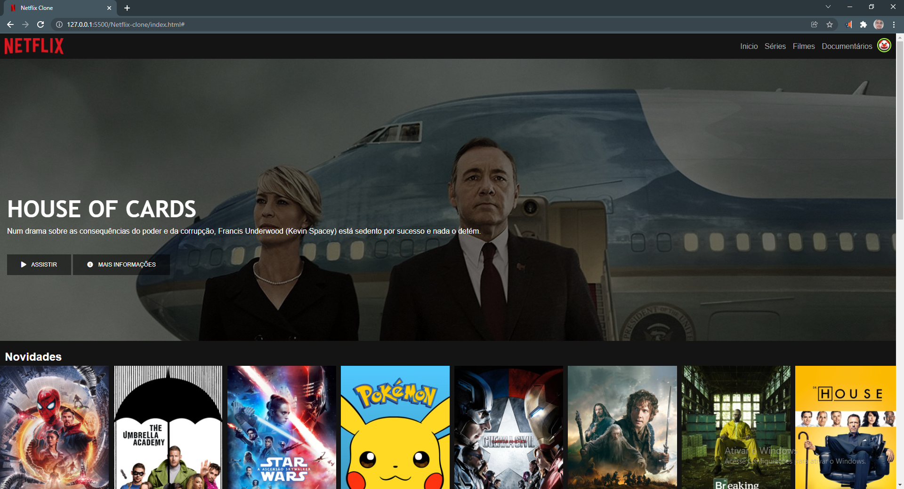
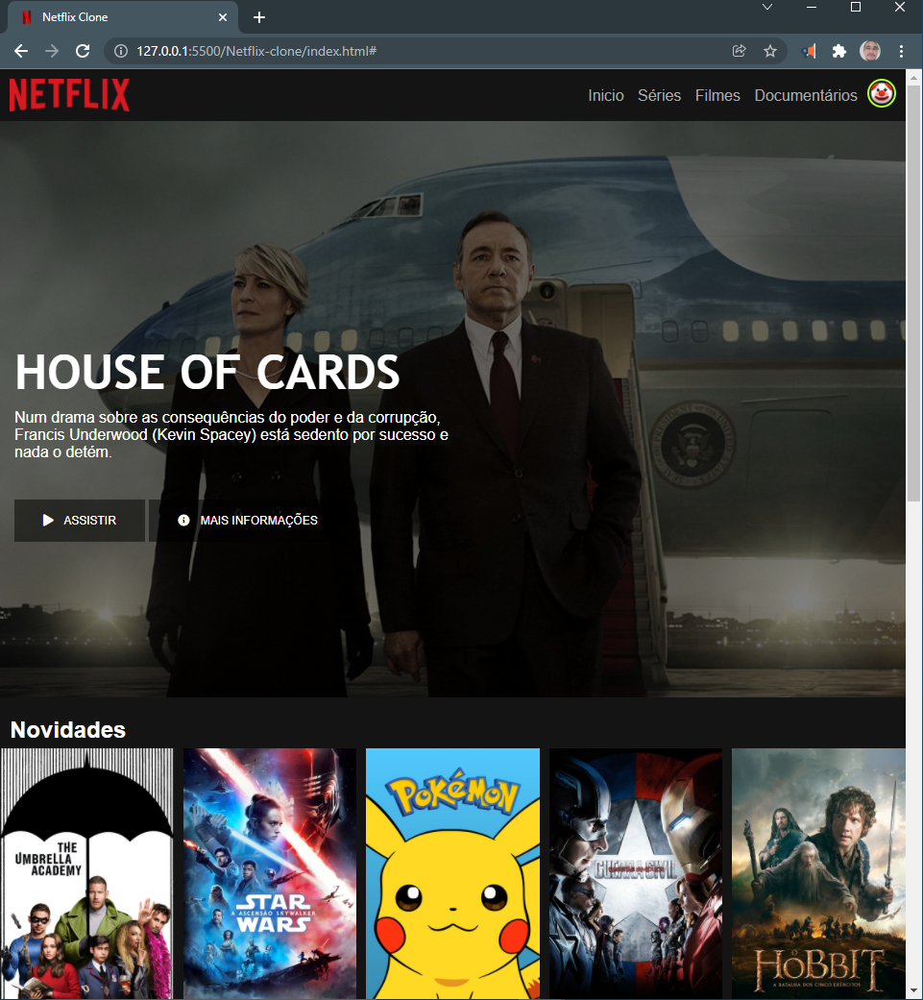
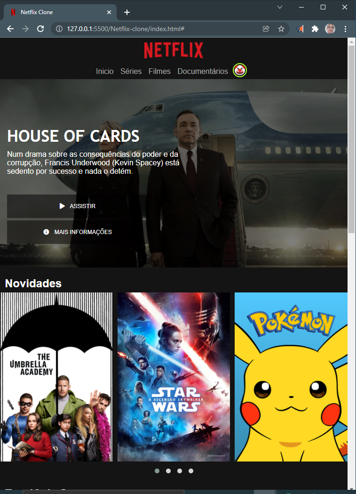
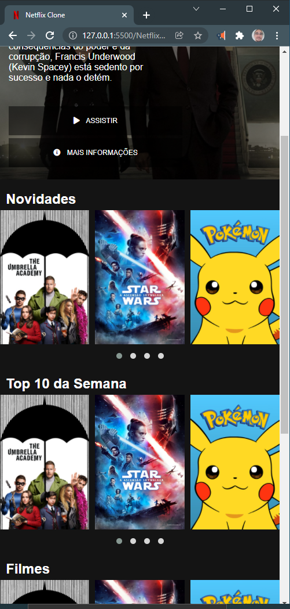

# Recriando a interface da Netflix

Atividade desenvolvida durante o Bootcamp Inter Frontend Developer. Meu próximo desafio será aproximar à versão mais atual da interface da Netflix e depois dar um ar mais pessoal ao projeto.

O projeto tem um pouco de JQuery e o site já é responsivo para vários formatos.
## Alguns prints do projeto
### Primeira versão:
#### Anexo 1

#### Anexo 2

#### Anexo 3

#### Anexo 4

